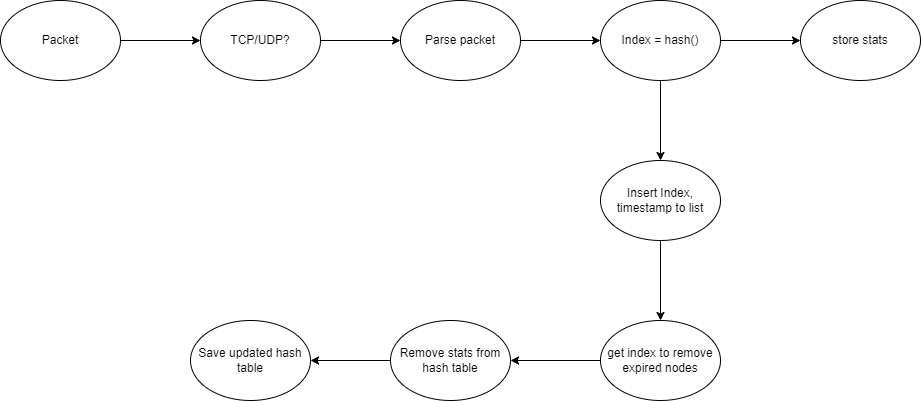

# Explains the traffic analysis example
## Introduction
Basic stats example logs the incoming TCP and UDP traffic statistics. Based on the 5 tuple (source IP, destination IP, source port, destination port, protocol), the example logs the number of packets and bytes received for each flow. The example uses a hash table to store the statistics. With the help of the 5 tuple values, we calculate the index to store the statistics. Based on the index, we store the latest timestamp of the packets received using a linked list based implementation. Once the timestamp of the index exceeds 60s we remove the packet from the hash table.

packet -> 5 tuple -> hash() -> index -> hash table -> store statistics
                                |
                                | -> linked list -> store timestamp

Working flow diagram in dpdk_flow.drawio.png

## tuple store
- `int hash(struct pkt_tuple t)` - calculates the index based on the 5 tuple values
- `int tuples_are_equal(struct pkt_tuple a, struct pkt_tuple b)` - compares the 5 tuple values
- `int insert(struct hash_table* ht, struct pkt_tuple t, uint32_t rx_bytes)` - inserts a new 5 tuple into the hash table
- `int remove_index(struct hash_table* ht, int index)` - removes a 5 tuple from the hash table
- `uint32_t get_count(struct hash_table* ht, struct pkt_tuple t)` - gets the count of a 5 tuple from the hash table
- `uint32_t get_size(struct hash_table* ht, struct pkt_tuple t)` - gets the size of a 5 tuple from the hash table
- `char* write_ipv4_addr(uint32_t ip)` - writes the IP address in dot notation
- `void save_hash_table(struct hash_table* ht, char* filename)` - saves the hash table to a file

## tuple timer
`void deleteNode(struct Node** head_ref, struct Node** tail_ref, int key)` - deletes the node with the given key from the list
- `void deleteAllNodes(struct Node** head_ref, struct Node** tail_ref, int key)` - deletes all nodes with the given key from the list
- `void insertNode(struct Node** head_ref, struct Node** tail_ref, int key)` - inserts a new node with the given key at the beginning of the list and updates the time if key already exists
- `struct removedKeys* removeOldNodes(struct Node** head_ref, struct Node** tail_ref)` - removes all nodes from the list that are older than 60 seconds and returns a list of removed keys
- `void printList(struct Node* node)` - prints the list of nodes

## basic stats
based on skeleton example from dpdk

`lcore_main ` functions handles the main logic
- for each packet received we check if the packet is TCP or UDP
- if the packet is TCP or UDP we calculate the 5 tuple values and store the statistics in tuple_data
- we calculate the index based on the 5 tuple values and store the statistics in the hash table
- we also store the timestamp of the index in the linked list
- we remove the index from the hash table if the timestamp exceeds 60s
- save the hash table to a file `hash_table.txt`

